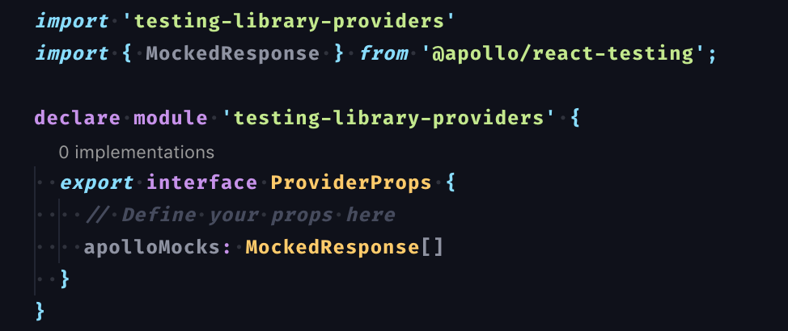
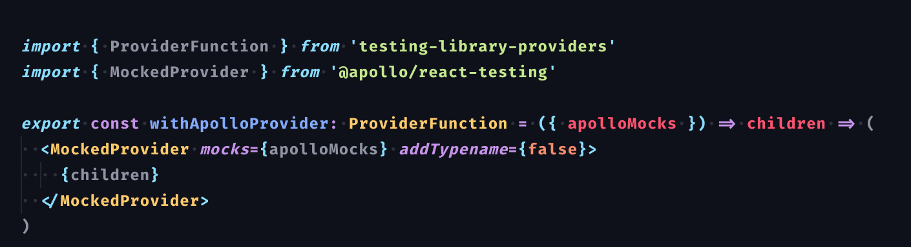
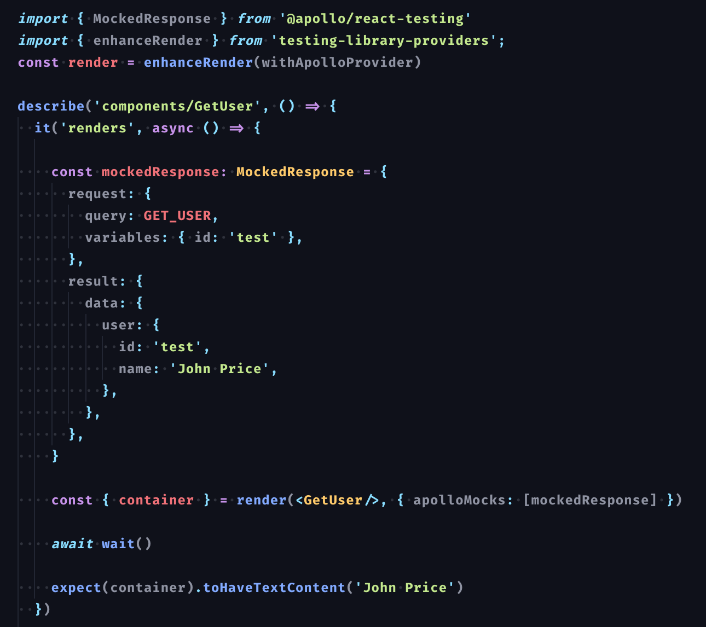

# testing-library-providers 🍡

`testing-library-providers` is utility for `@testing-library/react`

It allows you to nest provider components with ease

Note: `react`, `react-dom` and `@testing-library/react` are peer dependencies
# Install 🔧
`yarn add react react-dom`

`yarn add -D testing-library/react`

`yarn add -D testing-library-providers`

# Philosophy
Goal of this library is to compose several providers, and provide
props to them straight from the tests

# Example Usage with Typescript 🔥
First you should define your own typings for `ProviderProps`. You can extend current empty interface like this:

Then you write provider function:

Provider function is a function which recieves typed provider props and returns a function which gets react children

It's up to you then to wrap children with provider (or any other `react` component) and pass props if needed.

Now you are ready to use this library in a test

First you create `render` function by calling `enhanceRender` with arguments consisting of provider functions. This function is regular `render` function from `@testing-library/react` but it already wraps your component with providers

Note that order matter and providers will be composed from left to right

After that you are ready to render whatever you wish to test. If you want to pass some props, in this case mocked response to `ApolloProvider` you can do so by passing the mocks as a second parameter to `render` function.
Note that this is also fully typed.